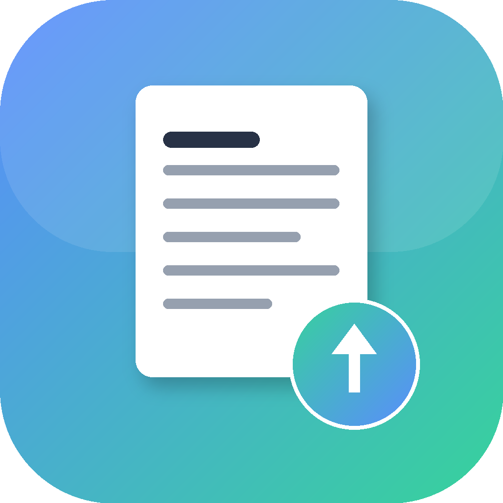

<p align="center"></p>

# RESOPT

Tailor your résumé to any job description in seconds and watch it update live.
**Bring your own AI key** (Anthropic, OpenAI, Google Gemini, Groq, or Perplexity) — your résumé and
key **never leave your computer**, and nothing is stored.

## Download

| Platform | Download |
|----------|----------|
| macOS | [**RESOPT-macOS.zip**](../../releases/latest/download/RESOPT-macOS.zip) |
| Windows | [**RESOPT.exe**](../../releases/latest/download/RESOPT.exe) |

Or browse the [**Releases**](../../releases) page.

## macOS — install & run

**Easiest (no errors).** Open **Terminal** and paste:

```bash
curl -L -o /tmp/RESOPT.zip https://github.com/praneethgaddam07/resopt/releases/latest/download/RESOPT-macOS.zip && unzip -o /tmp/RESOPT.zip -d /Applications && open /Applications/RESOPT.app
```

That downloads it, installs it to **Applications**, and opens it. Launch it anytime from Launchpad or Spotlight.

**Or from the browser:** download the zip, unzip it, then run this once (macOS may say *"RESOPT is damaged"* — it isn't; the app is just unsigned and this clears the download flag):

```bash
xattr -dr com.apple.quarantine ~/Downloads/RESOPT.app && open ~/Downloads/RESOPT.app
```

## Windows — install & run

Download **RESOPT.exe**, then double-click it. On the blue **Windows protected your PC** screen, click **More info -> Run anyway** (the app is unsigned).

## How to use

1. Get an AI key (any one): [Anthropic](https://console.anthropic.com/settings/keys) · [OpenAI](https://platform.openai.com/api-keys) · [Google Gemini](https://aistudio.google.com/app/apikey)
2. Open RESOPT, paste your key, upload your résumé, and paste the job description.
3. Click **Optimize** — see your tailored résumé live, edit/reorder sections, and **Download .docx**.

## Runs entirely on your machine

No servers, no sign-up, no storage. RESOPT runs a local process on your own computer; your API key and résumé are used in memory and discarded — nothing is uploaded or saved.

---
_Pay-as-you-go AI keys cost a few cents per résumé. The app is unsigned; the one-time commands above only remove the "downloaded from the internet" flag from this app._

## Source code

RESOPT is fully open source (MIT): the engine, ATS rules, validators, and this desktop app live at
**<https://github.com/praneethgaddam07/resume-optimizer>** — audit the "nothing stored" claim yourself, star it, or contribute.
